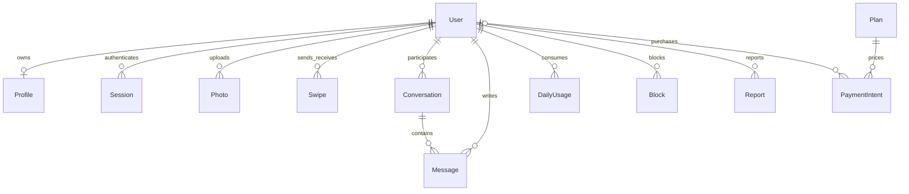

# Database model

Authoritative model: `prisma/schema.prisma`. Initial SQL is under `prisma/migrations/202609050001_initial/migration.sql`; it includes row-level-security enabling and extra CHECK constraints. UUID defaults are generated by Prisma, not SQL, so inserts outside Prisma must supply IDs.

## Compact design choices

Like and Pass share Swipe with a constrained kind. Match and Conversation share the same ordered pair record; one active conversation is created by mutual likes. Unmatching marks that conversation inactive, and does not automatically allow rematching. Languages, interests and discovery preferences live in Profile arrays/columns. Membership is represented by User.premiumUntil plus the immutable payment history snapshots; there is no separate Subscription table. Read receipts are per-participant timestamps in Conversation. Gender-based defaults are Policy rows, not scattered frontend rules.

PaymentIntent retains chargeId/amount/duration after account deletion but userId becomes null. Personal conversations/messages/reports/photos metadata are deleted through cascades; durable Outbox rows handle physical media removal. AuditLog uses detached actor IDs so account deletion does not break audit history. A deleted account's opaque identifiers may still exist in audit/financial records, which need operator-defined retention.

Indexes cover identity lookup, discovery fields, incoming likes, conversation history, daily usage and outbox scans. All application tables have RLS enabled with no public access policy; backend uses a privileged database role. For a separate restricted role, explicitly configure ownership or BYPASSRLS and table permissions. Never expose DATABASE_URL to the browser.

Schema was executed against embedded PostgreSQL/PGlite and used by the real Prisma service integration suite. Prisma migrate deploy against hosted Supabase and migration drift analysis against the operator database were not run here.
